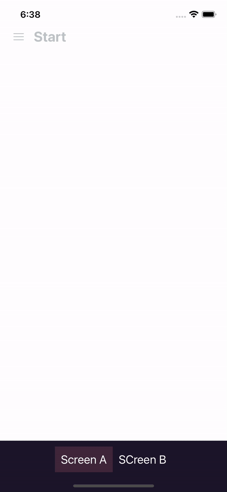

# React Native Animation Challenge.

## File System

I used a file system combining the file system commonly used in React Native and the file system used in clean architecture, in which all important files for basic functionality go into a folder called core, and the other files for other features would go in the features folder under the name of the corresponding feature, such as feature/home.

## Thought process

Normally, when starting to develop an animation, I always look for references such as [Catalin Miron](https://www.youtube.com/@CatalinMironDev), a React Native animation YouTuber, and also [William Candillon](https://www.youtube.com/@wcandillon), another React Native animation YouTuber. Both use many animation libraries, including the most popular, React Reanimated, both version 1 and version 2. In addition, I consult the documentation of the libraries to form an idea of what utilities to use.

Then, I generate a template of the animation with simple views and contrasting colors to see their interaction. Once they behave as expected, I proceed to place the final colors and finish creating the rest of the interface.

# Results

